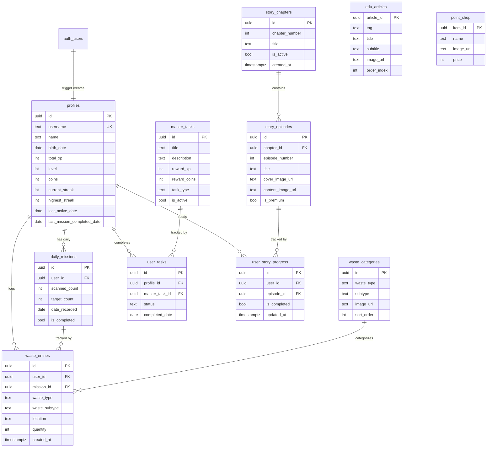

# 🗄️ Database Documentation — BinGo (Raion)

> **Platform:** Supabase (PostgreSQL)  
> **RLS:** Disabled (semua tabel)  
> **Last Updated:** 2026-03-08

---

## Arsitektur Database



---

## Alur Data Misi

```
User tekan "Mulai Kumpulkan!" → Wizard (jenis → subtipe → lokasi → jumlah)
        → RPC log_waste_entry()
            → INSERT waste_entries
            → UPDATE daily_missions.scanned_count
            → Per-entry reward: profiles.total_xp += qty×10, coins += qty×2
            → Jika scanned_count >= target_count:
                → TRIGGER on_mission_complete:
                    → Bonus: +50 XP, +10 coins
                    → update_daily_streak() → streak berdasarkan misi
                    → recalculate_level()
        → RETURN JSON {status, scanned_count, gained_xp, gained_coins, ...}
```

---

## Sistem Reward

| Aksi | XP | Coins | Sumber |
|------|-----|-------|--------|
| Per sampah dibuang | `quantity × 10` | `quantity × 2` | `log_waste_entry()` |
| Bonus misi selesai (5/5) | `+50` | `+10` | trigger `on_mission_complete` |
| Level up | — | — | `recalculate_level()`: `level = (total_xp / 100) + 1` |
| Streak | — | — | `update_daily_streak()`: berdasarkan `last_mission_completed_date` |

**Contoh: 5 entries × quantity 1 = Total: +100 XP, +20 Coins**
- Per-entry: 5 × (10 XP + 2 coins) = 50 XP + 10 coins
- Completion bonus: +50 XP + 10 coins

---

## Tabel Detail

### 1. `profiles`
User profile yang auto-created via trigger saat registrasi.

| Kolom | Tipe | Default | Deskripsi |
|-------|------|---------|-----------|
| `id` | UUID PK | — | FK ke `auth.users` |
| `username` | TEXT UNIQUE | — | Username login |
| `name` | TEXT | — | Nama tampilan |
| `birth_date` | DATE | NULL | Tanggal lahir |
| `total_xp` | INT | 0 | Total XP akumulasi |
| `level` | INT | 1 | Level = `(total_xp / 100) + 1` |
| `coins` | INT | 0 | Koin untuk toko |
| `current_streak` | INT | 0 | Streak misi berturut-turut |
| `highest_streak` | INT | 0 | Streak tertinggi sepanjang waktu |
| `last_active_date` | DATE | NULL | Terakhir buka app |
| `last_mission_completed_date` | DATE | NULL | Terakhir selesai misi 5/5 |

### 2. `daily_missions`
1 record per user per hari. Target default: 5 scan.

| Kolom | Tipe | Default | Deskripsi |
|-------|------|---------|-----------|
| `id` | UUID PK | random | — |
| `user_id` | UUID FK | — | → `profiles.id` |
| `scanned_count` | INT | 0 | Jumlah sampah tercatat hari ini |
| `target_count` | INT | 5 | Target harian |
| `date_recorded` | DATE | today | Tanggal misi |
| `is_completed` | BOOL | false | Auto true saat 5/5 (via trigger) |

**Constraint:** `UNIQUE (user_id, date_recorded)`

### 3. `waste_entries`
Log detail setiap aksi buang sampah.

| Kolom | Tipe | Default | Deskripsi |
|-------|------|---------|-----------|
| `id` | UUID PK | random | — |
| `user_id` | UUID FK | — | → `profiles.id` |
| `mission_id` | UUID FK | — | → `daily_missions.id` |
| `waste_type` | TEXT | — | `'organik'` / `'daur_ulang'` |
| `waste_subtype` | TEXT | — | `'buah'`, `'sayur'`, `'kaleng'`, `'kertas'`, `'plastik'` |
| `location` | TEXT | — | `'kantin'`, `'ruang_kelas'`, `'halaman'`, `'toilet'` |
| `quantity` | INT | 1 | Jumlah sampah (min 1) |
| `created_at` | TIMESTAMPTZ | now() | — |

### 4. `waste_categories`
Referensi kategori sampah (data statis dari admin).

| Kolom | Tipe | Deskripsi |
|-------|------|-----------|
| `id` | UUID PK | — |
| `waste_type` | TEXT | `'organik'` / `'daur_ulang'` |
| `subtype` | TEXT | `'buah'`, `'sayur'`, dll |
| `image_url` | TEXT | URL gambar |
| `sort_order` | INT | Urutan tampil di UI |

### 5. `master_tasks`
Template tugas yang bisa diselesaikan user.

| Kolom | Tipe | Default | Deskripsi |
|-------|------|---------|-----------|
| `id` | UUID PK | random | — |
| `title` | TEXT | — | Judul tugas |
| `description` | TEXT | — | Deskripsi |
| `reward_xp` | INT | 0 | XP reward |
| `reward_coins` | INT | 0 | Coin reward |
| `task_type` | TEXT | `'daily'` | Tipe tugas |
| `is_active` | BOOL | true | Aktif/nonaktif |

### 6. `user_tasks`
Tracking penyelesaian tugas per user.

### 7. `edu_articles`
Artikel edukasi untuk carousel di HomeScreen.

### 8. `point_shop`
Item yang bisa dibeli dengan koin.

### 9. `story_chapters`
Mengatur bab cerita (misi/komik) yang tersedia.

| Kolom | Tipe | Deskripsi |
|-------|------|-----------|
| `id` | UUID PK | — |
| `chapter_number` | INT | Urutan Bab |
| `title` | TEXT | Judul Bab |
| `is_active` | BOOL | Status aktif/tampil |

### 10. `story_episodes`
Detail tiap episode dalam sebuah bab.

| Kolom | Tipe | Deskripsi |
|-------|------|-----------|
| `id` | UUID PK | — |
| `chapter_id` | UUID FK | → `story_chapters.id` |
| `episode_number` | INT | Urutan Episode |
| `title` | TEXT | Judul Episode |
| `cover_image_url` | TEXT | Gambar cover (thumbnail) |
| `content_image_url` | TEXT | Gambar panjang isi komik (NULL jika coming soon) |
| `is_premium` | BOOL | (Sistem masa depan) |

### 11. `user_story_progress`
Mencatat progress penyelesaian episode oleh user.

| Kolom | Tipe | Deskripsi |
|-------|------|-----------|
| `id` | UUID PK | — |
| `user_id` | UUID FK | → `profiles.id` |
| `episode_id` | UUID FK | → `story_episodes.id` |
| `is_completed` | BOOL | Status selesai |
| `updated_at` | TIMESTAMPTZ | Kapan terakhir dimodifikasi |

---

## Functions

### `log_waste_entry(p_user_id, p_waste_type, p_waste_subtype, p_location, p_quantity, p_date)`

**Dipanggil dari:** Android `HomeRepository.logWasteEntry()`

```sql
CREATE OR REPLACE FUNCTION public.log_waste_entry(
    p_user_id       UUID,
    p_waste_type    TEXT,
    p_waste_subtype TEXT,
    p_location      TEXT,
    p_quantity      INT DEFAULT 1,
    p_date          DATE DEFAULT CURRENT_DATE   -- client kirim tanggal lokal
)
RETURNS JSON
LANGUAGE plpgsql SECURITY DEFINER SET search_path = public
AS $$
DECLARE
    v_mission_id    UUID;
    v_scanned       INT;
    v_target        INT;
    v_is_completed  BOOLEAN;
    v_xp_reward     INT;
    v_coin_reward   INT;
BEGIN
    -- 1. Pastikan daily mission untuk hari ini ada
    INSERT INTO public.daily_missions (user_id, date_recorded, target_count)
    VALUES (p_user_id, p_date, 5)
    ON CONFLICT (user_id, date_recorded) DO NOTHING;

    SELECT id, scanned_count, target_count, is_completed
    INTO v_mission_id, v_scanned, v_target, v_is_completed
    FROM public.daily_missions
    WHERE user_id = p_user_id AND date_recorded = p_date;

    -- 2. Cek apakah misi sudah selesai
    IF v_is_completed THEN
        RETURN json_build_object(
            'status', 'already_completed',
            'scanned_count', v_scanned,
            'target_count', v_target,
            'is_completed', TRUE,
            'gained_xp', 0,
            'gained_coins', 0
        );
    END IF;

    -- 3. Catat waste entry
    INSERT INTO public.waste_entries (
        user_id, mission_id, waste_type, waste_subtype, location, quantity
    ) VALUES (
        p_user_id, v_mission_id, p_waste_type, p_waste_subtype, p_location, p_quantity
    );

    -- 4. Update scanned_count (trigger handles completion)
    UPDATE public.daily_missions
    SET scanned_count = LEAST(scanned_count + p_quantity, target_count)
    WHERE id = v_mission_id;

    -- 5. Baca state terbaru (setelah trigger jalan)
    SELECT scanned_count, target_count, is_completed
    INTO v_scanned, v_target, v_is_completed
    FROM public.daily_missions WHERE id = v_mission_id;

    -- 6. Per-entry reward
    v_xp_reward := p_quantity * 10;      -- 10 XP per sampah
    v_coin_reward := p_quantity * 2;     -- 2 koin per sampah

    UPDATE public.profiles
    SET total_xp = total_xp + v_xp_reward,
        coins    = coins + v_coin_reward
    WHERE id = p_user_id;

    PERFORM public.recalculate_level(p_user_id);

    RETURN json_build_object(
        'status',         CASE WHEN v_is_completed THEN 'mission_complete' ELSE 'logged' END,
        'scanned_count',  v_scanned,
        'target_count',   v_target,
        'is_completed',   v_is_completed,
        'gained_xp',      v_xp_reward,
        'gained_coins',   v_coin_reward
    );
END;
$$;
```

> [!IMPORTANT]
> Return JSON hanya berisi **per-entry reward**. Bonus misi selesai (+50 XP, +10 coins) diberikan oleh trigger terpisah dan TIDAK termasuk dalam response. Android menghitung bonus ini secara optimistic di `HomeViewModel.applyMissionResult()`.

---

### `update_daily_streak(p_user_id, p_date)`

**Streak berdasarkan misi** (bukan login). Dipanggil oleh trigger `on_mission_complete`.

```sql
CREATE OR REPLACE FUNCTION public.update_daily_streak(p_user_id UUID, p_date DATE DEFAULT CURRENT_DATE)
RETURNS void
LANGUAGE plpgsql SECURITY DEFINER SET search_path = public
AS $$
DECLARE
    v_last_mission DATE;
BEGIN
    SELECT last_mission_completed_date INTO v_last_mission
    FROM public.profiles WHERE id = p_user_id;

    IF v_last_mission IS NULL THEN
        UPDATE public.profiles
        SET current_streak = 1, last_mission_completed_date = p_date
        WHERE id = p_user_id;

    ELSIF v_last_mission = p_date - INTERVAL '1 day' THEN
        UPDATE public.profiles
        SET current_streak = current_streak + 1,
            highest_streak = GREATEST(highest_streak, current_streak + 1),
            last_mission_completed_date = p_date
        WHERE id = p_user_id;

    ELSIF v_last_mission < p_date - INTERVAL '1 day' THEN
        UPDATE public.profiles
        SET current_streak = 1, last_mission_completed_date = p_date
        WHERE id = p_user_id;

    -- Jika last_mission = hari ini → sudah diupdate, skip
    END IF;
END;
$$;
```

---

### `recalculate_level(p_user_id)`

```sql
CREATE OR REPLACE FUNCTION public.recalculate_level(p_user_id UUID)
RETURNS void
LANGUAGE plpgsql SECURITY DEFINER SET search_path = public
AS $$
DECLARE
    v_new_level INT;
BEGIN
    SELECT (total_xp / 100) + 1 INTO v_new_level
    FROM public.profiles WHERE id = p_user_id;

    UPDATE public.profiles
    SET level = v_new_level
    WHERE id = p_user_id AND level < v_new_level;
END;
$$;
```

---

### `check_username_available(target_username)`

```sql
CREATE OR REPLACE FUNCTION public.check_username_available(target_username TEXT)
RETURNS BOOLEAN
LANGUAGE plpgsql SECURITY DEFINER SET search_path = public
AS $$
BEGIN
    RETURN NOT EXISTS (
        SELECT 1 FROM public.profiles WHERE username = target_username
    );
END;
$$;
```

---

### `complete_task(p_user_id, p_task_id, p_date)`

```sql
CREATE OR REPLACE FUNCTION public.complete_task(p_user_id UUID, p_task_id UUID, p_date DATE DEFAULT CURRENT_DATE)
RETURNS JSON
LANGUAGE plpgsql SECURITY DEFINER SET search_path = public
AS $$
DECLARE
    v_reward_xp    INT;
    v_reward_coins INT;
    v_new_total_xp INT;
    v_new_level    INT;
    v_already_done BOOLEAN;
BEGIN
    SELECT reward_xp, reward_coins INTO v_reward_xp, v_reward_coins
    FROM public.master_tasks WHERE id = p_task_id AND is_active = TRUE;

    IF NOT FOUND THEN
        RAISE EXCEPTION 'Tugas tidak ditemukan atau tidak aktif';
    END IF;

    SELECT EXISTS(
        SELECT 1 FROM public.user_tasks
        WHERE profile_id = p_user_id AND master_task_id = p_task_id
          AND completed_date = p_date
    ) INTO v_already_done;

    IF v_already_done THEN
        RAISE EXCEPTION 'Tugas ini sudah diselesaikan hari ini!';
    END IF;

    INSERT INTO public.user_tasks (profile_id, master_task_id, status, completed_date)
    VALUES (p_user_id, p_task_id, 'completed', p_date);

    UPDATE public.profiles
    SET total_xp = total_xp + v_reward_xp,
        coins    = coins + v_reward_coins
    WHERE id = p_user_id
    RETURNING total_xp INTO v_new_total_xp;

    PERFORM public.recalculate_level(p_user_id);
    SELECT level INTO v_new_level FROM public.profiles WHERE id = p_user_id;

    RETURN json_build_object(
        'status',        'success',
        'gained_xp',     v_reward_xp,
        'gained_coins',  v_reward_coins,
        'new_total_xp',  v_new_total_xp,
        'current_level', v_new_level
    );
END;
$$;
```

---

### `get_story_data(p_user_id)`

**Dipanggil dari:** Android `StoryRepository.getStoryData()`

```sql
CREATE OR REPLACE FUNCTION public.get_story_data(p_user_id UUID)
RETURNS JSON
LANGUAGE plpgsql SECURITY DEFINER SET search_path = public
AS $$
DECLARE
    result JSON;
BEGIN
    SELECT json_agg(
        json_build_object(
            'id', sc.id,
            'chapter_number', sc.chapter_number,
            'title', sc.title,
            'is_active', sc.is_active,
            'created_at', sc.created_at,
            'episodes', COALESCE(
                (
                    SELECT json_agg(
                        json_build_object(
                            'id', se.id,
                            'episode_number', se.episode_number,
                            'title', se.title,
                            'cover_image_url', se.cover_image_url,
                            'content_image_url', se.content_image_url,
                            'is_premium', se.is_premium,
                            'is_completed', EXISTS (
                                SELECT 1
                                FROM public.user_story_progress usp
                                WHERE usp.user_id = p_user_id
                                  AND usp.episode_id = se.id
                                  AND usp.is_completed = TRUE
                            )
                        ) ORDER BY se.episode_number
                    )
                    FROM public.story_episodes se
                    WHERE se.chapter_id = sc.id
                ),
                '[]'::json
            )
        ) ORDER BY sc.chapter_number
    )
    INTO result
    FROM public.story_chapters sc
    WHERE sc.is_active = TRUE;

    RETURN COALESCE(result, '[]'::json);
END;
$$;
```

---

## Triggers

### `on_auth_user_created`
Auto-create `profiles` saat registrasi via `auth.users`.

```sql
CREATE OR REPLACE FUNCTION public.handle_new_user()
RETURNS TRIGGER
LANGUAGE plpgsql SECURITY DEFINER SET search_path = public
AS $$
BEGIN
    INSERT INTO public.profiles (
        id, username, name, birth_date,
        total_xp, level, coins, current_streak
    ) VALUES (
        NEW.id,
        NEW.raw_user_meta_data ->> 'username',
        NEW.raw_user_meta_data ->> 'full_name',
        CASE
            WHEN NEW.raw_user_meta_data ->> 'birth_date' ~ '^\d{4}-\d{2}-\d{2}$'
            THEN (NEW.raw_user_meta_data ->> 'birth_date')::DATE
            ELSE NULL
        END,
        0, 1, 0, 0
    );
    RETURN NEW;
EXCEPTION WHEN OTHERS THEN
    INSERT INTO public.profiles (id, username, name, total_xp, level, coins, current_streak)
    VALUES (
        NEW.id,
        COALESCE(NEW.raw_user_meta_data ->> 'username', 'user_' || LEFT(NEW.id::text, 8)),
        COALESCE(NEW.raw_user_meta_data ->> 'full_name', 'Sobat Gobi'),
        0, 1, 0, 0
    );
    RETURN NEW;
END;
$$;

CREATE TRIGGER on_auth_user_created
    AFTER INSERT ON auth.users
    FOR EACH ROW EXECUTE FUNCTION public.handle_new_user();
```

### `on_mission_complete`
Auto-reward saat `daily_missions.scanned_count >= target_count`.

```sql
CREATE OR REPLACE FUNCTION public.handle_daily_mission_complete()
RETURNS TRIGGER
LANGUAGE plpgsql SECURITY DEFINER SET search_path = public
AS $$
BEGIN
    IF NEW.scanned_count >= NEW.target_count
       AND OLD.scanned_count < NEW.target_count THEN

        NEW.is_completed := TRUE;

        -- Bonus: +50 XP, +10 coins
        -- NOTE: TIDAK set last_mission_completed_date di sini
        -- karena update_daily_streak() yang handle (menghindari race condition)
        UPDATE public.profiles
        SET total_xp   = total_xp + 50,
            coins      = coins + 10
        WHERE id = NEW.user_id;

        PERFORM public.recalculate_level(NEW.user_id);

        -- Update streak dengan tanggal dari client (bukan CURRENT_DATE)
        PERFORM public.update_daily_streak(NEW.user_id, NEW.date_recorded);
    END IF;

    IF NEW.scanned_count > NEW.target_count THEN
        NEW.scanned_count := NEW.target_count;
    END IF;

    RETURN NEW;
END;
$$;

CREATE TRIGGER on_mission_complete
    BEFORE UPDATE ON public.daily_missions
    FOR EACH ROW EXECUTE FUNCTION public.handle_daily_mission_complete();
```

---

## Seed Data

```sql
-- Waste Categories
INSERT INTO public.waste_categories (waste_type, subtype, sort_order) VALUES
    ('organik', 'buah', 1),
    ('organik', 'sayur', 2),
    ('organik', 'sisa_makanan', 3),
    ('daur_ulang', 'kaleng', 1),
    ('daur_ulang', 'kertas', 2),
    ('daur_ulang', 'plastik', 3);

-- Master Tasks
INSERT INTO public.master_tasks (title, description, reward_xp, reward_coins, task_type) VALUES
    ('Buang sampah organik',   'Buang 1 sampah organik ke tempat yang benar',     10, 2, 'daily'),
    ('Buang sampah anorganik', 'Buang 1 sampah anorganik ke tempat yang benar',   10, 2, 'daily'),
    ('Buang sampah plastik',   'Buang 1 sampah plastik ke tempat yang benar',     10, 2, 'daily'),
    ('Pungut sampah di jalan', 'Temukan dan pungut sampah yang ada di sekitarmu', 15, 3, 'daily'),
    ('Pilah sampah rumah',     'Pisahkan sampah organik dan anorganik di rumah',  20, 5, 'daily');

-- Edu Articles
INSERT INTO public.edu_articles (tag, title, subtitle, image_url, order_index) VALUES
    ('Plastik',    'Keajaiban Daur Ulang!',         'Pernahkah kamu membayangkan punya tongkat ajaib...', NULL, 1),
    ('Lingkungan', 'Mengenal Daur Ulang Sampah',    'Pelajari bagaimana sampah bisa diolah kembali...', NULL, 2),
    ('Fakta',      'Dampak Sampah Plastik di Laut', 'Setiap tahun, 8 juta ton plastik berakhir di laut...', NULL, 3);

-- Point Shop
INSERT INTO public.point_shop (name, image_url, price) VALUES
    ('Kaos Gobi',   'kaos_gobi',   20),
    ('Topi Gobi',   'topi_gobi',   30),
    ('Stiker Gobi', 'stiker_gobi', 10);

-- Story Schema Creation Notes --
/*
CREATE TABLE public.story_chapters (
    id UUID PRIMARY KEY DEFAULT gen_random_uuid(),
    chapter_number INT NOT NULL,
    title TEXT NOT NULL,
    is_active BOOLEAN DEFAULT TRUE,
    created_at TIMESTAMPTZ DEFAULT NOW(),
    UNIQUE (chapter_number)
);

CREATE TABLE public.story_episodes (
    id UUID PRIMARY KEY DEFAULT gen_random_uuid(),
    chapter_id UUID REFERENCES public.story_chapters(id) ON DELETE CASCADE,
    episode_number INT NOT NULL,
    title TEXT NOT NULL,
    cover_image_url TEXT,
    content_image_url TEXT,
    is_premium BOOLEAN DEFAULT FALSE,
    UNIQUE (chapter_id, episode_number)
);

CREATE TABLE public.user_story_progress (
    id UUID PRIMARY KEY DEFAULT gen_random_uuid(),
    user_id UUID REFERENCES public.profiles(id) ON DELETE CASCADE,
    episode_id UUID REFERENCES public.story_episodes(id) ON DELETE CASCADE,
    is_completed BOOLEAN DEFAULT FALSE,
    updated_at TIMESTAMPTZ DEFAULT NOW(),
    UNIQUE (user_id, episode_id)
);
*/
```

---

## Integrasi Android

### Repository → RPC Mapping

| Android Function | Supabase Call | Tabel/RPC |
|-----------------|---------------|-----------|
| `HomeRepository.logWasteEntry()` | `rpc("log_waste_entry")` | RPC |
| `HomeRepository.getUserProfile()` | `select` from `profiles` | Tabel |
| `HomeRepository.getActiveMissions()` | `select` from `daily_missions` | Tabel |
| `HomeRepository.getWasteCategories()` | `select` from `waste_categories` | Tabel |
| `HomeRepository.getTopPlayerProfiles()` | `select` from `profiles` ORDER BY `total_xp` | Tabel |
| `HomeRepository.getEducationalArticles()` | `select` from `edu_articles` | Tabel |
| `HomeRepository.getPointShopItems()` | `select` from `point_shop` | Tabel |
| `AuthRepository.checkUsernameAvailability()` | `rpc("check_username_available")` | RPC |
| `StoryRepository.getStoryData()` | `rpc("get_story_data")` | RPC |
| `StoryRepository.markEpisodeCompleted()` | `upsert` to `user_story_progress` | Tabel |

### Optimistic UI & Reactive State Pattern

Data update di HomeScreen menggunakan **optimistic update + background sync**:

```
Submit misi → RPC return per-entry reward
  → Android INSTANT update:
      XP  += per-entry + (bonus 50 if complete)
      Coins += per-entry + (bonus 10 if complete)
      Level = (new_xp / 100) + 1
      Streak += 1 (if complete)
  → 500ms later: background fetch profiles → koreksi jika ada selisih
```

### Kotlin Data Models

```kotlin
// WasteEntryResponse — maps to log_waste_entry JSON result
// Default values prevent crash when 'already_completed' branch omits fields
@Serializable
data class WasteEntryResponse(
    @SerialName("status") val status: String = "logged",
    @SerialName("scanned_count") val scannedCount: Int = 0,
    @SerialName("target_count") val targetCount: Int = 5,
    @SerialName("is_completed") val isCompleted: Boolean = false,
    @SerialName("gained_xp") val gainedXp: Int = 0,
    @SerialName("gained_coins") val gainedCoins: Int = 0
)

// UserProfile — maps to profiles table
@Serializable
data class UserProfile(
    val id: String, val username: String, val name: String,
    @SerialName("total_xp") val totalXp: Int,
    val level: Int, val coins: Int,
    @SerialName("current_streak") val currentStreak: Int,
    @SerialName("last_mission_completed_date") val lastMissionCompletedDate: String?
)
```

---

## Statistik

| Kategori | Jumlah | Detail |
|----------|--------|--------|
| **Tabel** | 11 | `profiles`, `daily_missions`, `waste_entries`, `waste_categories`, `master_tasks`, `user_tasks`, `edu_articles`, `point_shop`, `story_chapters`, `story_episodes`, `user_story_progress` |
| **Functions** | 7 | `check_username_available`, `recalculate_level`, `complete_task`, `update_daily_streak`, `log_waste_entry`, `handle_new_user`, `get_story_data` |
| **Triggers** | 2 | `on_auth_user_created`, `on_mission_complete` |
| **Indexes** | 6 | Leaderboard, username, daily queries, waste history |
| **Constraints** | 20+ | UNIQUE, CHECK, FK CASCADE |
